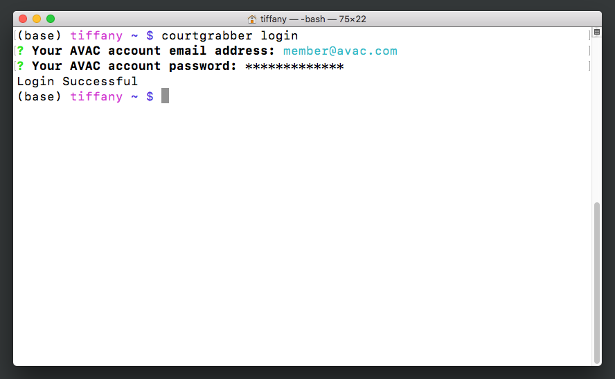
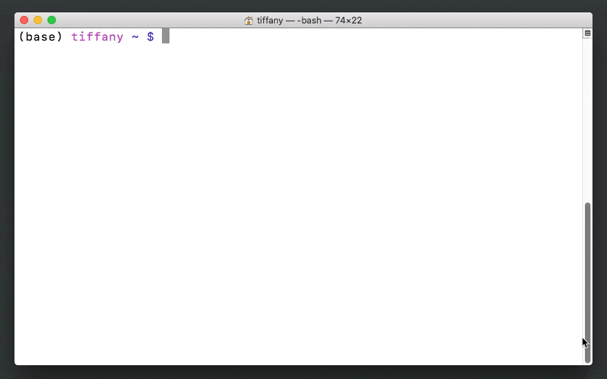
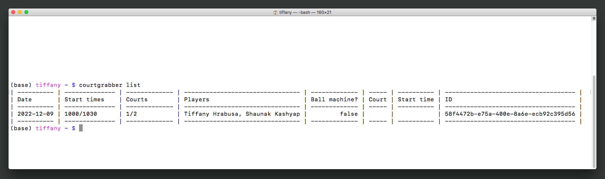
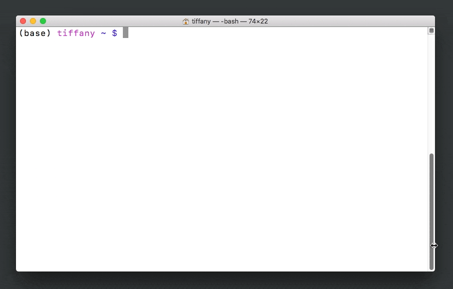
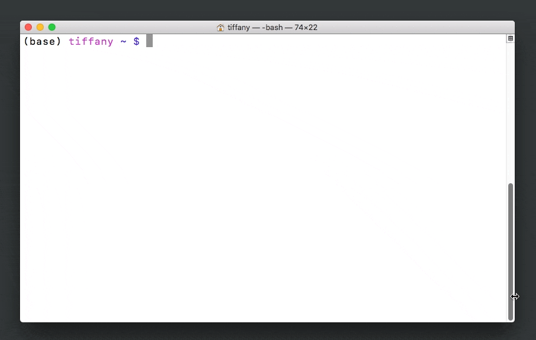
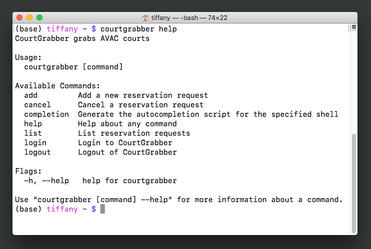

# User Guide

The following user guide walks you through how to use Courtgrabber from the command line. You'll want to install Courtgrabber first; the [Getting Started page](./getting_started.md) tells you how to do that. If you would like to learn more about the Courtgrabber REST API, please refer to the [developer guide](./api_reference.md). 

## Logging into Courtgrabber

You can use your tennis club account to log into the Courtgrabber program.

1. With your terminal window open to the command prompt, type `courtgrabber login` and press `Enter`. The screen will prompt you for your tennis club email address.
2. Enter your club email address and press `Enter`.
3. At the next prompt, enter your club password.

You see a `Login Successful` message.

*Figure 2: Logging into Courtgrabber.*

## Creating a court reservation request

Courtgrabber makes it easy to request a court reservation: just follow the prompts! If you have questions about any of the prompts, refer to the definitions of key terms in the [Getting Started guide](./getting_started.md).

1. After you have logged into Courtgrabber, type `courtgrabber add` at the command prompt and press `Enter`. The screen prompts you for required information.
2. Type your desired date as `YYYY-MM-DD` and press `Enter`.
3. Type your desired start times, in order of preference, in `HHMM` 24-hour format separated by commas and then press `Enter`.
4. Using your up and down arrow keys, select your desired duration and press `Enter`.
5. Type your desired court numbers, in order of preference and separated by commas, then press `Enter`.
6. Using your up and down arrow keys, select the name of the host player and press `Enter`.
7. Using the arrow keys, select `y` if you would like to reserve a ball machine. Otherwise, select `n`. Press `Enter`.
8. Use the arrow keys to select whether or not you will have a second player and press `Enter.`

!!! note 
    If you are not using a ball machine, you must include a second player to reserve a court.

The CLI displays a message with the Reservation Request ID.

*Figure 3: Creating a court reservation request.*

## Listing all reservation requests

You can view all active reservation requests using one simple command.

1. While logged in, type `courtgrabber list` at the command prompt and press `Enter`.

You see a table displaying all of your pending requests in chronological order.

*Figure 4: Listing all reservation requests.*

## Canceling a pending reservation request

While a request is still pending, you can cancel it from the Courtgrabber CLI. 

!!! note 
    Once a reservation is made, you must cancel it through your tennis club's reservation system.

1. While logged in, type `courtgrabber cancel` at the command prompt and press `Enter`.
2. Using the up and down arrow keys, scroll through the list of your pending requests until you come to the one you wish to cancel. Press `Enter`. The CLI asks you to confirm that you want to cancel the reservation.
3. Use the arrow keys to select `y` for yes, and then press `Enter`.

You see a `Reservation request {id} cancelled` message.

*Figure 5: Canceling a pending reservation request.*

## Logging out of Courtgrabber

For the security of your account, you should logout and quit your terminal session when you are finished using Courtgrabber.

1. At the command prompt, type `courtgrabber logout` and press `Enter`.
Courtgrabber asks you to confirm that you want to logout.
2. Type `y` for yes, and then press `Enter`.
You see a `Logout Successful` message.
3. Once again at the command prompt, type `exit` and press `Enter`. 

Your terminal session is closed, and you can safely close the CLI window.

*Figure 6: Logging out of Courtgrabber.*

## Getting help with Courtgrabber

If you forget which command to use, you can always ask Courtgrabber for help.

1. At the command line, type `courtgrabber help` and press `Enter`.

Courtgrabber displays its help screen, which includes a list of available commands.

*Figure 7: Getting help with Courtgrabber.*

